# 🧩 8-Puzzle Game

A sophisticated Progressive Web App (PWA) implementation of the classic 8-puzzle sliding tile game, featuring advanced AI algorithms, difficulty levels, and comprehensive puzzle solving capabilities.



## 🌟 Features

### 🎮 Core Gameplay
- **Interactive 8-puzzle game** with smooth animations
- **Multiple difficulty levels**: Very Easy (1-4 moves) to Extreme (25+ moves)
- **Custom difficulty**: Set specific number of moves (0-31)
- **Random puzzle generation** with guaranteed solvability
- **Progress tracking** with real-time chart visualization
- **Timer and move counter** for performance tracking

### 🤖 AI & Algorithms
- **A* pathfinding algorithm** for optimal puzzle solving
- **Manhattan distance heuristic** with linear conflict detection
- **Pattern database optimization** for enhanced performance
- **Guaranteed optimal solutions** with IDA* (Iterative Deepening A*)
- **Solution caching** for improved performance
- **Real-time minimum moves calculation**

### 📱 Progressive Web App (PWA)
- **Offline functionality** with service worker caching
- **Installable** on mobile and desktop devices
- **Responsive design** optimized for all screen sizes
- **Background synchronization** and update notifications
- **Optimized performance** with smart caching strategies

### 📊 Analytics & Visualization
- **Real-time progress chart** using Chart.js
- **Difficulty visualization** with color-coded indicators
- **Performance metrics** tracking nodes explored and solve time
- **Progress percentage** and completion statistics

### 🎯 Pre-generated Puzzles
- **32 difficulty files** with thousands of pre-computed puzzle states
- **Instant puzzle loading** from optimized JSON data
- **Balanced difficulty distribution** ensuring fair gameplay
- **Smart fallback** to algorithmic generation when needed

## 🚀 Getting Started

### Prerequisites
- Modern web browser with JavaScript enabled
- Web server for serving files (due to CORS restrictions)

### Installation

1. **Clone the repository**
   ```bash
   git clone https://github.com/yourusername/8-puzzle-game.git
   cd 8-puzzle-game
   ```

2. **Serve the files**
   
   Using Python:
   ```bash
   python -m http.server 8000
   ```
   
   Using Node.js:
   ```bash
   npx serve .
   ```
   
   Using PHP:
   ```bash
   php -S localhost:8000
   ```

3. **Open in browser**
   Navigate to `http://localhost:8000`

### PWA Installation
- On mobile: Tap "Add to Home Screen" when prompted
- On desktop: Click the install button in the address bar
- Or use the installation prompt that appears in the app

## 🎯 How to Play

1. **Select difficulty** using the dropdown menu or set custom moves
2. **Click "Shuffle"** to generate a new puzzle
3. **Click tiles** adjacent to the empty space to move them
4. **Arrange numbers** 1-8 in order with the empty space in bottom-right
5. **Use "Solve"** to see the optimal AI solution
6. **Track progress** with the real-time chart

## 🧠 Algorithm Details

### A* Pathfinding
The game implements an optimized A* algorithm with:
- **Manhattan distance heuristic**: Calculates minimum moves for each tile
- **Linear conflict detection**: Identifies tiles blocking each other
- **Priority queue optimization**: Efficient node exploration
- **State caching**: Prevents re-exploration of visited states

### Difficulty Generation
Puzzles are generated using multiple strategies:
1. **Pre-computed states**: 32 JSON files with optimal move counts
2. **Random shuffling**: For extreme difficulties
3. **Partial solving**: Adjusting difficulty by solving partially
4. **Validation**: Ensuring all puzzles are solvable

### Performance Optimizations
- **Solution caching**: Stores optimal paths for quick lookup
- **Intermediate state caching**: Speeds up subsequent calculations
- **Pattern database**: Pre-computed heuristic values
- **Smart pruning**: Eliminates unpromising search branches

## 📁 Project Structure

```
8-puzzle-game/
├── index.html              # Main HTML file
├── manifest.json          # PWA manifest
├── service-worker.js      # Service worker for offline functionality
├── logo.svg              # Game logo
├── .htaccess             # Apache configuration
├── assets/
│   ├── css/
│   │   └── style.css     # Game styling
│   ├── js/
│   │   ├── script.js     # Main game logic
│   │   └── chart.js      # Chart visualization
│   └── move_data/        # Pre-generated puzzle states
│       ├── index.json    # Metadata
│       └── moves_*.json  # Puzzle states by difficulty
└── icons/                # PWA icons
    ├── icon-192x192.svg
    └── icon-512x512.svg
```

## 🔧 Technical Implementation

### Core Classes

#### `PuzzleGame`
Main game controller handling:
- Game state management
- Move validation and execution
- AI solver integration
- Difficulty generation
- Cache management

#### `PuzzleChart`
Chart visualization using Chart.js:
- Real-time progress tracking
- Difficulty level indicators
- Performance metrics display
- Responsive design

#### `TinyQueue`
Optimized priority queue for A* algorithm:
- Efficient heap operations
- Custom comparison functions
- Memory-optimized implementation

### Key Features

#### Smart Caching System
```javascript
// Solution caching for optimal performance
this.solutionCache = new Map();
this.stateCache = new Map();
this.pathCache = new Map();
```

#### A* Algorithm Implementation
```javascript
// Optimized A* with Manhattan distance heuristic
aStar() {
    const openSet = new TinyQueue([{
        state: [...this.grid],
        path: [],
        f: 0,
        g: 0
    }], (a, b) => a.f - b.f);
    // ... implementation details
}
```

#### PWA Service Worker
```javascript
// Caching strategy for offline functionality
const CACHE_NAME = '8puzzle-cache-v6';
const CRITICAL_RESOURCES = [
    './',
    'index.html',
    'assets/css/style.css',
    // ... other resources
];
```

## 📊 Performance Metrics

- **Optimal solution guarantee**: Always finds shortest path
- **Fast puzzle generation**: < 100ms for most difficulties
- **Efficient memory usage**: Smart caching reduces redundant calculations
- **Responsive UI**: Non-blocking algorithms with progress updates
- **Offline capability**: Full functionality without internet connection

## 🎨 Customization

### Difficulty Levels
Modify difficulty ranges in `script.js`:
```javascript
getDifficultyRange(difficultyLevel) {
    switch (difficultyLevel) {
        case 'very-easy': return { min: 1, max: 4, label: "Very Easy" };
        case 'easy': return { min: 5, max: 9, label: "Easy" };
        // ... add custom levels
    }
}
```

### Styling
Customize appearance in `assets/css/style.css`:
- Color schemes
- Animation timings
- Layout responsive breakpoints
- Chart styling

### Algorithm Parameters
Adjust AI performance in `script.js`:
- Time limits for solving
- Cache sizes
- Heuristic weights
- Node exploration limits

## 🛠️ Development

### Building Pre-generated Data
The `assets/move_data/` files contain pre-computed puzzle states. To regenerate:

1. Use the built-in puzzle generator
2. Extract states for each difficulty level
3. Format as JSON with structure:
   ```json
   {
     "moves": 5,
     "count": 20,
     "states": [[1,5,2,4,8,3,7,0,6], ...]
   }
   ```

### Testing
- Test across different browsers and devices
- Verify PWA installation and offline functionality
- Validate puzzle generation for all difficulty levels
- Check algorithm performance with complex puzzles

## 🔄 Updates & Versioning

The app uses semantic versioning and automatic update detection:
- Service worker handles cache updates
- Users receive notifications for new versions
- Background sync ensures latest features

## 🤝 Contributing

1. Fork the repository
2. Create a feature branch
3. Implement your changes
4. Add tests if applicable
5. Submit a pull request

### Areas for Contribution
- Additional solving algorithms (BFS, DFS variants)
- New difficulty generation strategies
- UI/UX improvements
- Performance optimizations
- Mobile-specific features

## 📄 License

MIT License - see LICENSE file for details

## 🙏 Acknowledgments

- Chart.js for visualization
- A* algorithm research papers
- PWA best practices documentation
- Web performance optimization guides

## 📞 Support

For issues, questions, or suggestions:
- Open an issue on GitHub
- Check existing documentation
- Review the algorithm explanations

---

**Enjoy solving puzzles! 🧩**
